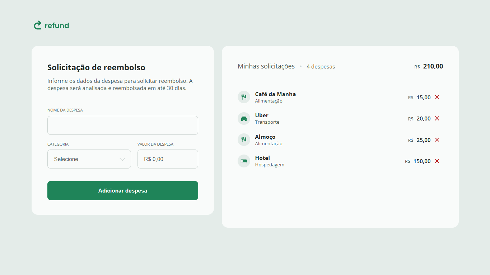

# 💸 Refund - Reembolso de Despesas 

O **Refund** é uma aplicação simples desenvolvida em JavaScript para gerenciar despesas durante viagens a trabalho, permitindo que o usuário registre suas despesas e acompanhe o valor total a ser reembolsado pela empresa.



## ⚙️ Funcionalidades

- 💵 **Adicionar Despesas**: O usuário pode adicionar uma despesa informando o valor 💵 e a categoria 🏷️ da despesa.
- 🏷️ **Categorias de Despesas**: As despesas podem ser classificadas em categorias, como alimentação 🍔, transporte 🚗, hospedagem 🏨, entre outras.
- 📊 **Geração de Relatório**: O aplicativo gera automaticamente um relatório detalhado das despesas inseridas e o valor total a ser reembolsado 💰.

## 🖥️ Tecnologias Utilizadas

- ⚙️ **JavaScript**: Para lógica de funcionamento e manipulação de dados.
- 📝 **HTML**: Para estruturação da página.
- 🎨 **CSS**: Para estilização da interface.

## 🚀 Como Usar

📌 1. Clone o repositório:

```bash
git clone https://github.com/joschonarth/refund-tracker
```

📌 2. Abra o arquivo `index.html` no seu navegador 🌐.

📌 3. Adicione uma despesa selecionando a categoria 🏷️ e inserindo o valor 💵 da despesa.

📌 4. Após adicionar as despesas, um relatório será gerado automaticamente 📈, mostrando a lista de despesas e o valor total a ser reembolsado.

## 🤝 Contribuindo

Se você deseja contribuir com o projeto, fique à vontade para abrir uma pull request ou uma issue.

## 📞 Contato

<div>
    <a href="https://www.linkedin.com/in/joschonarth/" target="_blank"></a>
    <a href="mailto:joschonarth@gmail.com" target="_blank"></a>
</div>